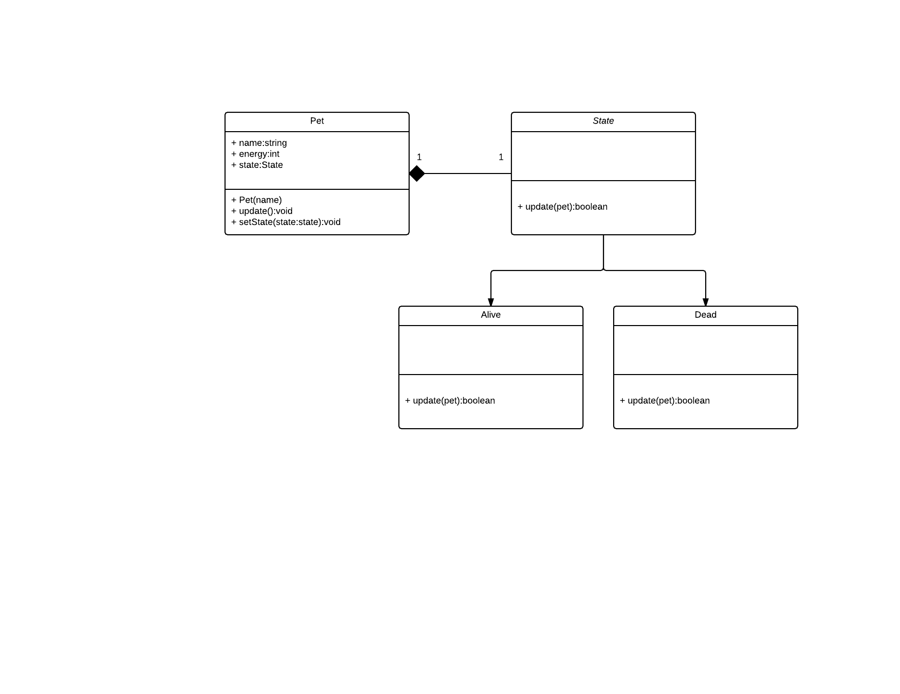

# ObjectOrientedPet (OOP)

This repository contains the result of the adversign media live coding session 1.



## Goals
- Build "something" in less than 1 hour.
- Teach OOP-Thinking.
- Show how to write unit tests with jest.
- Testing and documentation is part of coding.
- Play with new ES6 features.
- Have fun while we do it.

## Usage
Create instance of pet
```javascript
const { Pet } = require('./pet');
```
Call update to make the pet live
```javascript
pet.update();
```
Add EventListener to get notified if the pet changes
```javascript
pet.on(Pet.EVENT_UPDATE, (pet) => {
  const { name, energy } = pet;
  console.log(`Name: ${name}, Energy: ${energy}`);
});

pet.on(Pet.EVENT_STATE_CHANGE, (pet) => {
  const { name, state } = pet;
  console.log(`${name} is now ${state.constructor.name}`);
});
```
